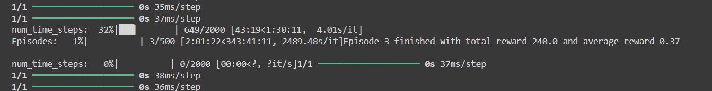

# Keysight_AI-ML-intern_design_question
Repository for solutions to Keysight Design questions for AI/ML intern position.

## Design Problem 1: 
Build RL solution which has initially a bad policy, so learn the correct policy over time based on the correct/incorrect actions taken by agent.

### Solution 1:
Play the Pac-Man game using Deep Q-Network(DQN).

GIF of the agent playing `MS PacMan` game environment using Gym:

succefully run the DQN for 3 episodes which take 2 hr. The complete execution of DQN on 500 episodes is expected to take 300+ hours.

To develop a fully working solution for Problem statement, now use a simpler algorithm on a smaller environent(done in following soluiton 2)

### Solution 2:
Solve the Cliff Walking problem and and compare the performance using Q-Learning, SARSA, Expected-SARSA

GIF of the agent traversing in the `Cliff Walking` environment using Gym:

video of the agent reaching in the goal in `Cliff Walking` environment using the learned policy:

https://github.com/user-attachments/assets/a62e50e8-98f1-4971-82f1-ed14b09ddc5e

## Design Problem 2:
Build a model to detect presence of Inductor (spiral shaped) using the given Test Spiral.kicad_pcb file.

### Solution:
