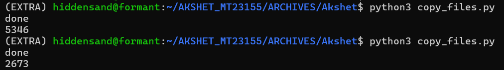
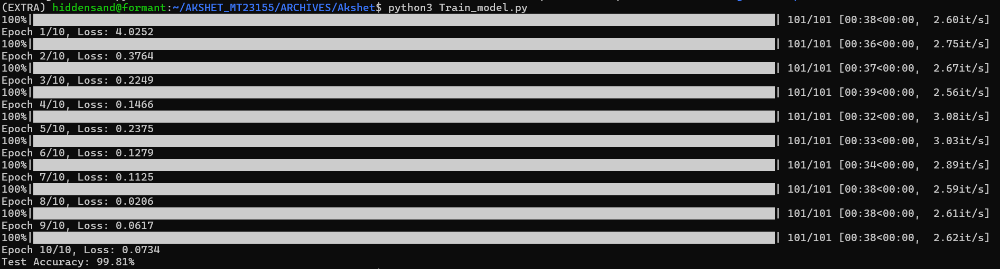

# Keysight AI-ML intern Design Questions
The repository contains ***scratch solutions*** to Keysight Design questions for AI/ML intern positions.

Submitted by: Shreyas Gupta, Akshet Patial

PPT Link can be found [here](https://www.canva.com/design/DAGUxl9WK2w/FqY6THyusRtpmI54AMLEMQ/edit?utm_content=DAGUxl9WK2w&utm_campaign=designshare&utm_medium=link2&utm_source=sharebutton)

## Design Problem Statement 1: 
Build an RL solution, which initially has a bad policy, so learn the correct policy over time based on the correct/incorrect actions taken by the agent.

***NOTE: Both the solutions have been implemented from scratch***

### Proposed Solution 1:
Play the Pac-Man game using Deep Q-Network(DQN).

GIF of the agent playing `MS PacMan` game environment using Gym:

Successfully run the DQN for 3 episodes, which take 2 hr. The complete execution of DQN on 500 episodes and 2000 steps is expected to take 300+ hours.

To develop a fully working solution for the given Problem statement, now use a simpler algorithm on a smaller environment  (done in following solution 2)

### Proposed Solution 2:
Solve the Cliff Walking problem and compare the performance using Q-Learning, SARSA, Expected-SARSA

GIF of the agent traversing in the `Cliff Walking` environment using Gym:

Video of the agent reaching the Goal state in the `Cliff Walking` environment using the learned policy:

The comparison plot for algorithms used in solution 2 is as follows:

## Design Problem Statement 2:
Build a model to detect the presence of an Inductor (spiral-shaped) using the given Test Spiral.kicad_pcb file.

### DataSet Creation: 
Parse the .kicad_pcb file and extract shapes and layer information based on proximity using `DBSCAN` clustering.

Notes:
We may need to adjust the eps parameter in `DBSCAN` for optimal clustering based on the proximity of shapes.

### Data Augmentation:
We did data augmentation on the image generated above using:

PiecewiseAffine: Applies distortions for pronounced effects.

GridDistortion: Distorts the image by altering grid sections to create various effects. some of the images are shown below

In the augmented data, some other augmentations were also used, making a total of 8019 images, with 5346 non-spiral images and 2673 spiral images.

### Training the Model

The spiral and Non-Spiral Images have been saved in their respective directories

The following models could have been used: `VGG-19`, `VGG-16`, and `AlexNet`; here, `VGG19` was used to train the model.

Each image is labeled based on its directory (0 for spirals, 1 for non-spirals).

The script splits the dataset into training and test sets (80/20).

Considering the problem as a classification problem, weighted cross-entropy loss was used to address any imbalance in the dataset.

Running the model for 10 Epochs of Testing, the Accuracy reaches 99.81%.

### Inferencing the Model
The model takes Test_Spiral.kicad_pcb file as an input and gives the count of the number of Spiral found in the KiCad file along with the Spiral itself

