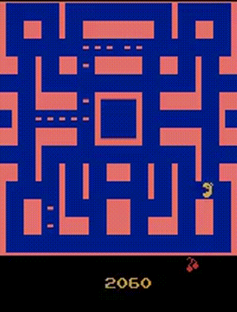

# Keysight_AI-ML-intern_design_question
Repository for solutions to Keysight Design questions for AI/ML intern position.

## Design Proeblem 1: 
Build RL solution which has initially a bad policy, so learn the correct policy over time based on the correct/incorrect actions taken by agent.

### Solution 1:
Play the Pac-Man game using Deep Q-Network(DQN).

GIF of the agent playing `MS PacMan` using Gym:

### Solution 2:
Solve the Cliff Walking problem and and compare the performance using Q-Learning, SARSA, Expected-SARSA

GIF of the agent trversing `Cliff Walking` environment using Gym:

## Design Problme 2: Build a modle to detect presence of Inductor (spiral shaped) using the given Test Spiral.kicad_pcb file.
### Solution:
